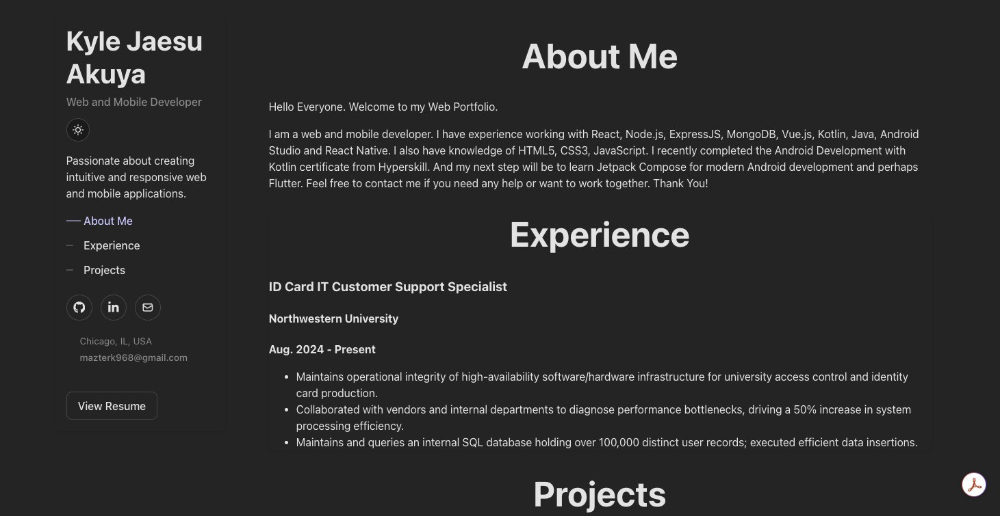

# Kyle Jaesu Akuya Web Portfolio

A personal portfolio built with React and Vite to showcase web, mobile, and desktop projects.

🔗 **Live site:** [https://jaesu968.github.io/WebPortfolio](https://jaesu968.github.io/WebPortfolio)





## Tech Stack

- React 19
- Vite
- React Router (`HashRouter`)
- react-icons
- JavaScript (JSX)
- CSS
- Vitest + React Testing Library (jsdom)
- ESLint

## Features

- Sidebar layout with in-page navigation (About, Experience, Projects) and social links (GitHub, LinkedIn, email)
- Light/dark theme toggle (persisted via `localStorage`, respects system preference)
- Intro/about section
- Experience section
- Project grid with tech stack icons per project
- Media preview support (images and videos)
- Click-to-open modal for enlarged media
- Resume section with downloadable PDF
- Contact footer with email and GitHub profile

## Project Structure

```
.
├── index.html
├── eslint.config.js
├── package.json
├── vite.config.js
├── public/
└── src/
    ├── App.jsx / App.css        # Main layout and page sections
    ├── main.jsx                 # Entry point (wraps App in HashRouter)
    ├── index.css
    ├── projects.js              # Project data (the content source for the project grid)
    ├── assets/                  # Project screenshots, demo videos, and resume PDF
    ├── components/              # UI components (each with a co-located .test.jsx file)
    │   ├── ContactCard.jsx
    │   ├── Experience/
    │   ├── Modal.jsx / Modal.css
    │   ├── ProjectCard.jsx
    │   ├── Resume.jsx
    │   ├── Sidebar/
    │   ├── TechIcon.jsx
    │   └── ThemeToggle.jsx
    └── test/
        └── setup.js             # Vitest setup (jest-dom, localStorage/matchMedia mocks)
```

## Local Development

1. Install dependencies:

```bash
npm install
```

2. Start the dev server:

```bash
npm run dev
```

3. Open the local URL shown in the terminal (typically `http://localhost:5173/`).

## Available Scripts

- `npm run dev` - start local development server
- `npm run build` - create production build in `dist/`
- `npm run preview` - preview the production build locally
- `npm run lint` - run ESLint checks
- `npm test` - run tests in watch mode (Vitest)
- `npm run test:run` - run the test suite once
- `npm run deploy` - run tests, build, and deploy `dist/` to GitHub Pages (uses `gh-pages`)

## Testing

Tests use [Vitest](https://vitest.dev/) with [React Testing Library](https://testing-library.com/docs/react-testing-library/intro/) in a jsdom environment. Test files live next to the components they cover (e.g. `Sidebar.test.jsx`). Shared setup — jest-dom matchers and mocks for `localStorage`/`matchMedia` (needed by `ThemeToggle`) — lives in `src/test/setup.js` and is configured in `vite.config.js`.

```bash
npm test          # watch mode
npm run test:run  # single run (also used by predeploy)
```

## Deployment

Deployed to GitHub Pages:

- `vite.config.js` sets `base: "/WebPortfolio/"` for production builds (and `/` for local dev)
- `HashRouter` is used instead of `BrowserRouter` so routes work on GitHub Pages, which can't handle client-side route paths on page refresh
- `predeploy` runs the test suite before building, so a failing test blocks the deploy

Deploy with:

```bash
npm run deploy
```

## Adding a Project

Project cards are driven by data in `src/projects.js`. To add a project:

1. Drop its screenshot/video into a new folder under `src/assets/`
2. Import the media at the top of `src/projects.js`
3. Add an object to the `projects` array with a unique `id`, `title`, `description`, `tech` list, media URLs, `githubUrl`, and `type` (`web` or `mobile`)

## Notes

- Modal behavior and accessibility are implemented in `src/components/Modal.jsx`
- Tech stack icons are mapped in `src/components/TechIcon.jsx`
